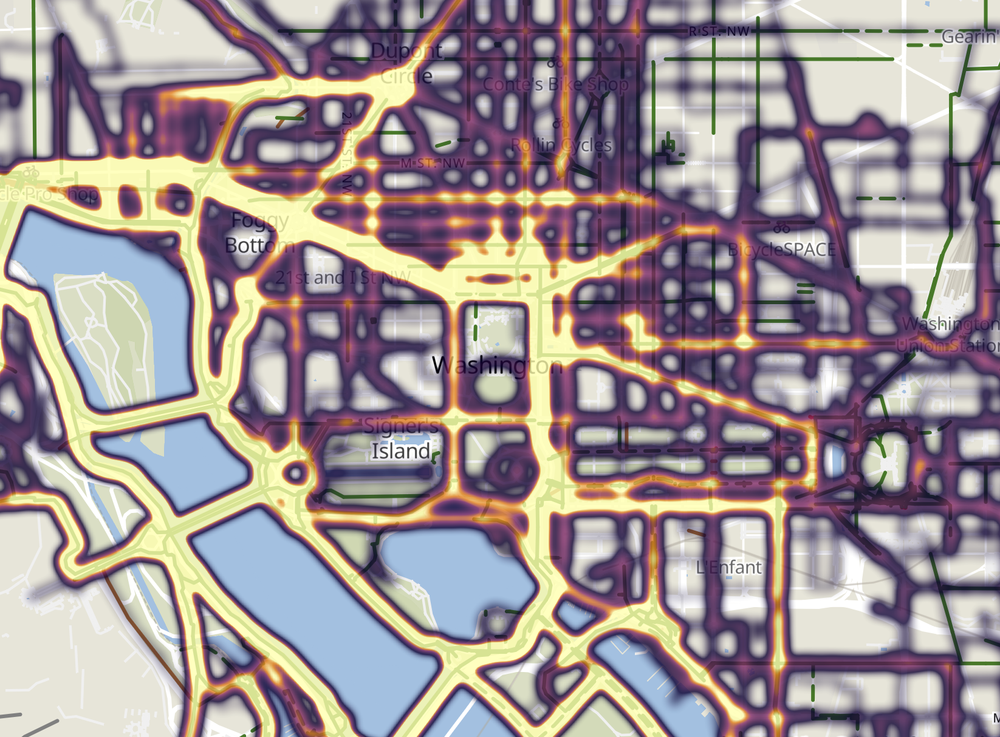

# heatmap-geojson.py

script to produce a heatmap geojson from gpx files



## usage

* download your gpx files to the `gpx` folder  
(if you're using strava, see https://support.strava.com/hc/en-us/articles/216918437-Exporting-your-Data-and-Bulk-Export)

* run `python3 heatmap-geojson.py`

### command-line options
```
usage: heatmap-geojson.py [-h] [--gpx-dir DIR] [--gpx-filters FILTERS]
                          [--skip-distance N] [--max-val N] [--round-digits N]
                          [--output FILE] [--quiet]

generate a local heatmap geojson from gpx files

optional arguments:
  -h, --help            show this help message and exit
  --gpx-dir DIR         directory containing the gpx files (default: gpx)
  --gpx-filters FILTERS
                        glob filter(s) for the gpx files (default: *.gpx)
  --skip-distance N     compression: read points that change the position by
                        this distance in meters (default: 10)
  --max-val N           maximum value for a heatmap point (default: 20)
  --round-digits N      how many decimal places to round digits to (default:
                        5)
  --output FILE         output geojson file (default: heatmap.geojson)
  --quiet               quiet output

report issues to github.com/arichnad/heatmap-geojson
```

## python dependencies
* [geopy](https://pypi.org/project/geopy/)

### setup

* `pip3 install --user --requirement requirements.txt`

